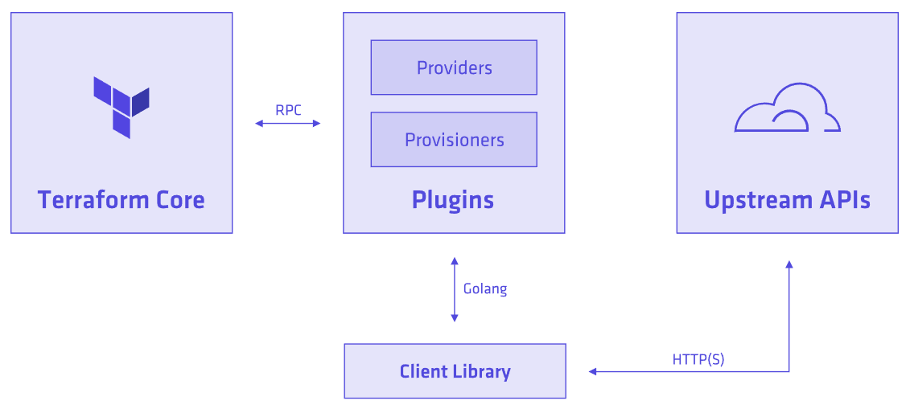

#Background

As a part of simplifying and improving Athenz user experience, we would like to offer our customers Infrastructure As Code capability.

Terraform relies on plugins called "providers" to interact with cloud providers, SaaS providers, and other APIs.

Each provider adds a set of resource types and/or data sources that Terraform can manage. Every resource type is implemented by a provider; without providers, Terraform can't manage any kind of infrastructure.

Very good example can be found : 

#Concepts
Each provider adds a set of resource types and/or data sources that Terraform can manage.
Every resource type is implemented by a provider; without providers, Terraform can't manage any kind of infrastructure.

##Data source
Data sources allow Terraform use information defined outside of Terraform, defined by another separate Terraform configuration, or modified by functions.

##Resources
Resources are the most important element in the Terraform language. Each resource block describes one or more infrastructure objects.

